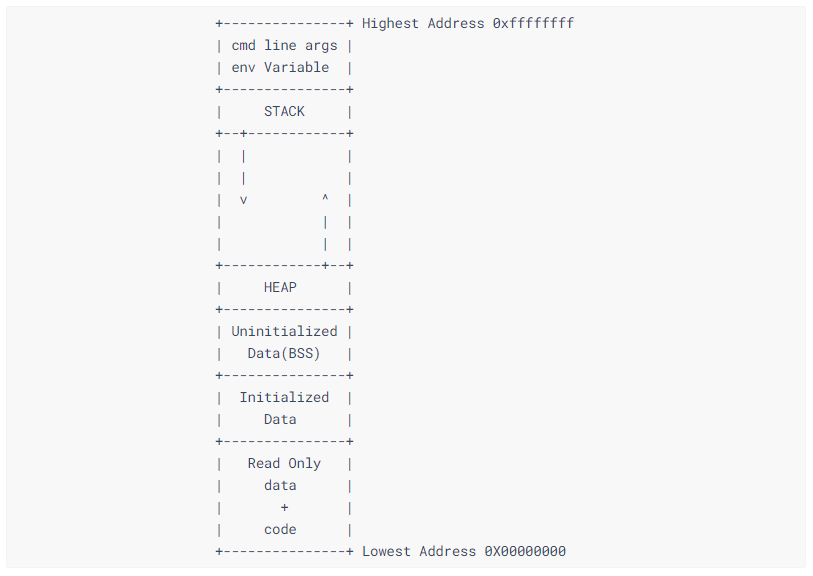
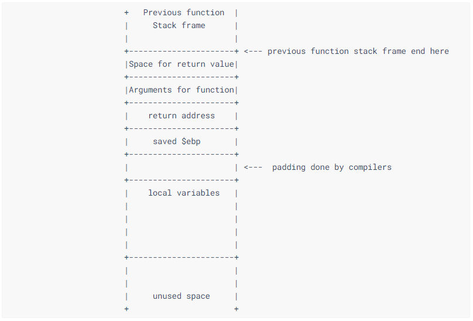
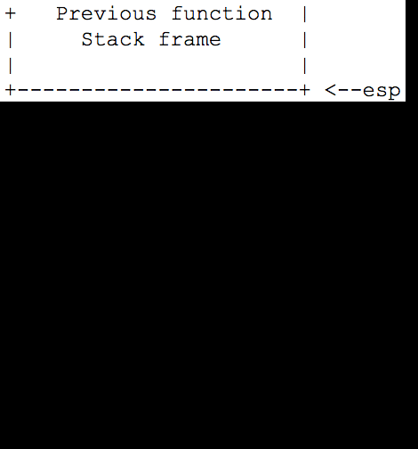
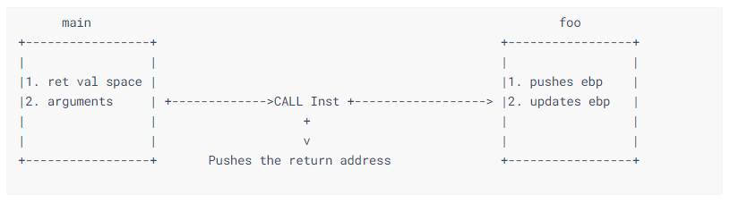

# Lecture 1: Understanding Memories - 理解内存空间
[](https://gitprint.com/r0hi7/BinExp/master/Lecture1/README.md).

[Video Lecture Hindi](https://www.youtube.com/watch?v=cNtbqYgOQuk&t=8s)

本节学习：
 ```
 1、ELF文件介绍，以及可执行文件运行时在内存中的样子
 2、发生函数调用时Stack的状态
 3、ASM初入
 4、关于什么是$ebp和$esp
 ```


### ELF

> 在计算机中 Executable and Linkable Format (ELF, formerly named Extensible Linking Format), 包括 executable files, object code, shared libraries, 和 core dumps 这几类文件的一种标准文件格式.
Ref : [ELF](https://en.wikipedia.org/wiki/Executable_and_Linkable_Format)

简单说 ELF 是一种基本的格式，它指定了一类文件(binary code, 包括 executable 和 linkable)运行时在内存中的状态。 ELF headers（ELF文件头）包含了大量关于该ELF文件的信息。我们可以通过下面的指令来查看ELF头，例如：

`readelf -h ./function_call`

```
ELF Header:
  Magic:   7f 45 4c 46 01 01 01 00 00 00 00 00 00 00 00 00
  Class:                             ELF32
  Data:                              2's complement, little endian
  Version:                           1 (current)
  OS/ABI:                            UNIX - System V
  ABI Version:                       0
  Type:                              EXEC (Executable file)
  Machine:                           Intel 80386
  Version:                           0x1
  Entry point address:               0x8048310
  Start of program headers:          52 (bytes into file)
  Start of section headers:          6860 (bytes into file)
  Flags:                             0x0
  Size of this header:               52 (bytes)
  Size of program headers:           32 (bytes)
  Number of program headers:         9
  Size of section headers:           40 (bytes)
  Number of section headers:         36
  Section header string table index: 33
```


留意两个对接下来的讨论很重要的点：

1. **Type:** EXEC,  表示这个是一个可执行文件
2. **Data:** 2's complement, **little endian**, 表示这个binary是被编译地址小端优先的
    [什么是小端优先 ?](https://en.wikipedia.org/wiki/Endianness)


### ELF文件运行时在内存中的布局：




​	

​	上面这图显示的是所有32位的 binary 映射到 4GB 大小的虚拟地址空间内存时的状态。
​	这里是按照 栈底 -> 栈顶，从上往下增长的顺序画的这个 stack （高地址在上面，低地址在下面）可以看到Stack的增长方向和Heap的增长方向，恰好是相反的。


下面让我们一起，由上往下来了解下这些不同的 段:

1. 第一部分：存储的是执行程式的时候，给程式的命令行参数和环境变量

2. **Stack**: 函数的参数，以及函数中的局部变量存放在stack中，参数是从右往左逆序存放的（栈的结构特点）。

3. **Heap**: 存放由使用 \*alloc 函数族分配的动态内存空间

4. **BSS**: BSS段存放未初始化的（全局 + 静态）变量，通常它们会被初始化为**0**

5. 接着是 Init data 段，存储的是已经被初始化了的（全局 + 静态）变量

6. 最后一段存储着所有的 **read-only** variables(只读变量) 和该程式的机器码

   

### 执行函数调用时栈的布局：


​	在发生子函数调用时，栈首先保存主调函数（caller func）的状态。这样，当从被调用函数（called func）中返回的时时候程式就可以回到子函数调用前保存的地址继续正常执行下去。

​	当发生子函数调用发生时，栈的布局如下：




### How stack grows:


接下来让我们来理解是如何通过 `ebp` 和 `esp` 来实现栈的功能的。

栈往低地址方向增长：



1. **esp**: 正如你在上图中看到的，栈指针（esp）在每次 push(入栈) 操作后都会不断变化。实际上 ESP 就是栈顶指针，它永远指向栈顶。

2. **ebp**: 程序在内存中跑起来，创建变量不再像是代码中的关联一个名字（变量名），它们被存储为指向栈底的引用。而这个指针就是存放在 ebp 寄存器中的。EBP 是栈底指针。这也就解释了为什么一个 func 在调用另外一个 func 的时候，ebp 的值就被 push 进 stack 中，然后 ebp 寄存器就可以继续用来存放新的栈帧了。


### Assembly language


​	高级语言类 C 经过编译步骤可以得到 ASM ，通过ASM可以转换得到 机器码 opcode（机器码和汇编指令是可以一一对应的，opcode是汇编代码的十六进制表示）。


示例：使用`objdump`反汇编示例程序`function_call`得到汇编代码和相应的opcode：


`objdump -d ./function_call`

```assembly
0804840b <foo>:
 804840b:    55                       push   %ebp
 804840c:    89 e5                    mov    %esp,%ebp
 804840e:    83 ec 08                 sub    $0x8,%esp
 8048411:    83 ec 0c                 sub    $0xc,%esp
 8048414:    68 d0 84 04 08           push   $0x80484d0
 8048419:    e8 c2 fe ff ff           call   80482e0 <printf@plt>
 804841e:    83 c4 10                 add    $0x10,%esp
 8048421:    90                       nop
 8048422:    c9                       leave
 8048423:    c3                       ret

08048424 <main>:
 8048424:    8d 4c 24 04              lea    0x4(%esp),%ecx
 8048428:    83 e4 f0                 and    $0xfffffff0,%esp
 804842b:    ff 71 fc                 pushl  -0x4(%ecx)
 804842e:    55                       push   %ebp
 804842f:    89 e5                    mov    %esp,%ebp
 8048431:    51                       push   %ecx
 8048432:    83 ec 04                 sub    $0x4,%esp
 8048435:    e8 d1 ff ff ff           call   804840b <foo>
 804843a:    b8 00 00 00 00           mov    $0x0,%eax
 804843f:    83 c4 04                 add    $0x4,%esp
 8048442:    59                       pop    %ecx
 8048443:    5d                       pop    %ebp
 8048444:    8d 61 fc                 lea    -0x4(%ecx),%esp
 8048447:    c3                       ret
 8048448:    66 90                    xchg   %ax,%ax
 804844a:    66 90                    xchg   %ax,%ax
 804844c:    66 90                    xchg   %ax,%ax
 804844e:    66 90                    xchg   %ax,%ax
```


这里只列出了 main 和 foo fucntion, 注意观察 main 函数中对 foo 的调用。

1. 留意 `main` 中的 call 指令前没有进行过 push 操作。这意味着 `foo` 这个函数不需要任何传入参数。
2. **call** 指令会向 CPU 发出请求，把 return address (当前EIP所指向address的下一个address) push 进 stack 中。而这一切都是由 **call** 这一条汇编指令完成。
3. foo 中的第一条指令是把 **ebp** push 进栈中
4. foo 中接下来的一条指令是把 **ebp** 指向 **esp**
5. foo 中再下一条指令是把 **esp** 中的值减去立即数 0x8  （说白了foo中前三条指令就是为foo函数开辟新的栈空间）


如下图所示：




### Assembly Language 2


​	在前面的 **Assembly language** 代码中, 介绍了函数调用的汇编代码是什么样的，接下来我们要介绍 **buffer** 在汇编中的样子。源程序：

```c
#include <stdio.h>

void foo(){
    char ch[10];
    printf("Calling from fucntion");
}

int main(){
    foo();
    return 0;
}
```
​	相对地，foo函数的汇编代码：
```assembly
0804840b <foo>:
 804840b:    55                       push   %ebp
 804840c:    89 e5                    mov    %esp,%ebp
 804840e:    83 ec 18                 sub    $0x18,%esp
 8048411:    83 ec 0c                 sub    $0xc,%esp
 8048414:    68 d0 84 04 08           push   $0x80484d0
 8048419:    e8 c2 fe ff ff           call   80482e0 <printf@plt>
 804841e:    83 c4 10                 add    $0x10,%esp
 8048421:    90                       nop
 8048422:    c9                       leave
 8048423:    c3                       ret
```
​	你可能会注意到这里有两次 `sub`
```assembly
804840e:    83 ec 18                 sub    $0x18,%esp
8048411:    83 ec 0c                 sub    $0xc,%esp
```

​	到目前为止，第一个 `sub` 的作用前面讲过是开辟新的栈空间。

​	后一个 `sub` 在讲这一节的概念中很重要。后一个 `sub` 实际上更新了stack的状态，为的是给 **foo** 中的局部变量 **ch** 分配内存空间。这一节需要理解的概念是：字符数组就是buffer。（ 你可能会注意到这里是静态内存分配，但`sub 0xc`和源代码中定义的字符数组**ch** 的长度并不一致 ）


