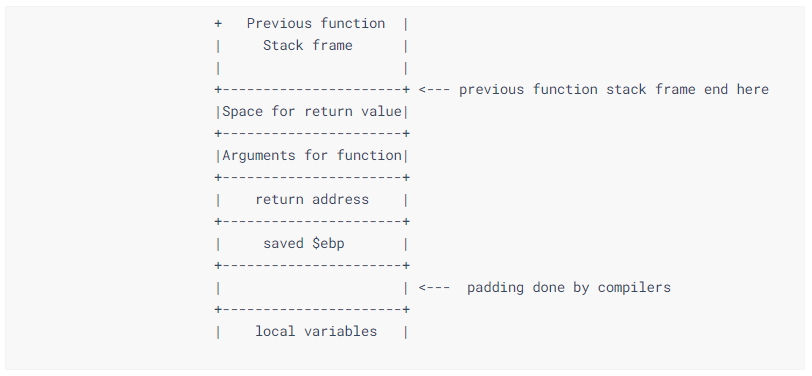
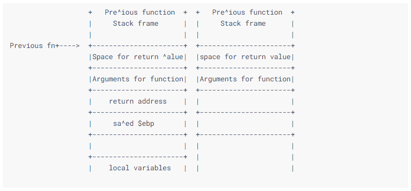
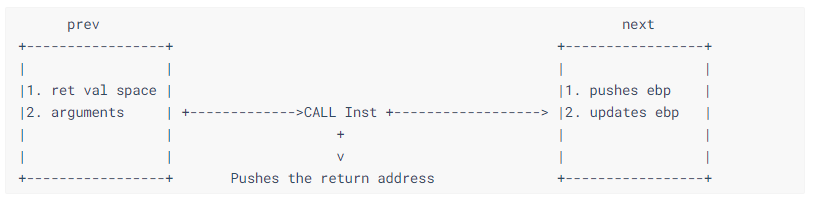
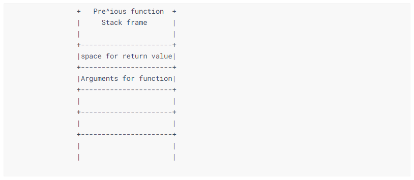
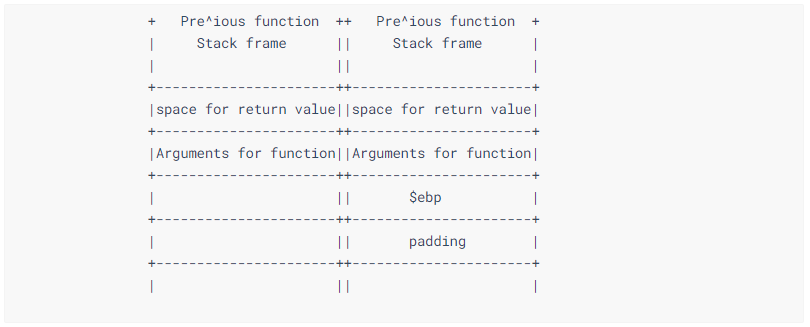
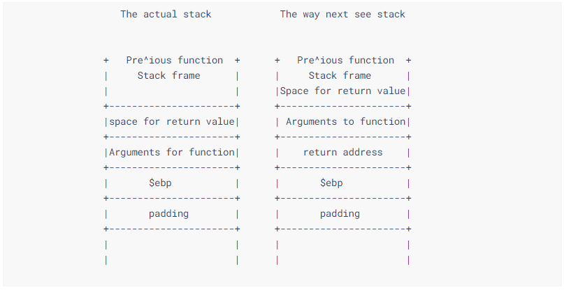
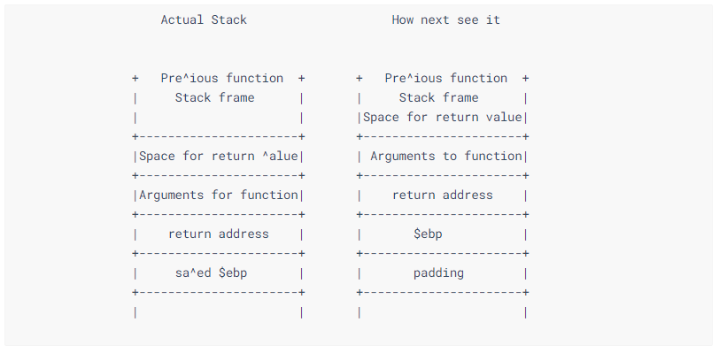

# Return 2 Libc attack


`ret2libc` 攻击的适用场景：

* 内存不可执行
* cannary关闭
* 仅开启ASLR


​	就如名字描述的一样，这种攻击的原理是利用栈溢出，更改return address为 `libc.so` 中的函数的地址。对于学习这种攻击方式，我们需要掌握如何修改stack中的数据，使得返回指针可以指向实际的 CALL 指令。这就需要理解函数调用时stack的布局。如果不熟悉的话可以复习 [Lecture](../Lecture1/README.md) .




​	这张图是函数调用时，初始化新函数栈帧以及执行完新函数，从新函数中返回时栈的情况：



​	

​	我们知道 `CALL` 指令的作用是跳转执行。在上一节中我们已经介绍过 `CALL` 的本质是执行了三条汇编指令。因此，想要改变执行流，我们需要在STACK中重构出这样的效果。	




​	对当前函数作出如下假设：

```
  1. 原本存放返回值和函数参数的空间已经被清除
  2. 新函数的空间和ret addr已经被push进栈了
  3. 新的ret addr已经被push进栈
```

​	

​	因此，当新函数返回后，STACK看起来应该是下面这个样子（我们以这个为最初的状态开始构造）：




​	当执行流跳转到下一个函数时，会把 `$ebp` 压栈。这时栈布局会看起来像这样：




​	下一个函数知道 ret addr 应该是位于 `$ebp` 上面，因此它会把 `argument previous function` 当作是它自己（函数）的 `return address`




​	通过对比第一张图和最后一张图，我们会发现Stack似乎偏移了4个bytes。




​	总结：我们需要利用BOF把Stack构造成现在这样，对于下一个要执行的函数而言stack看起来像右边那副图那样。


#### Executing Return 2 libc.


覆盖stack使其执行调用 `system` 函数的方式和上面介绍的一样，只不过在这里下一个要调用的函数是`system` 

为了更优雅地退出，我们可以在调用 `system` 后再加一个`exit` 来退出 :smile: .


Exploit 的 payload 大概长这样：

```shell
echo -e `python -c "import struct; print 'A'*108 + 'BBBB' + 'CCCC' + struct.pack('<I', <address of system>) + struct.pack('<I', <address of exit>) + <Address of argument to system>"`
```


下一步是需要寻找到 `system` 函数的地址、`exit`的地址 和 `要传给system的参数` 的地址（我们想要的是`/bin/sh`）来获得shell

可以用`GDB`来寻找这些地址。但有些时候`"/bin/sh"`在应用程序本身中是找不到的，这时我们又可以想到环境变量或许可以帮上忙（环境变量总在靠近stack上方一点的位置）。创建一个环境变量：`export SHELL="/bin/sh"`

然后使用GDB调起程序，打印 `$esp` 开始的 500 个string `gef> x/100s $esp`

然后找到我们设置的环境变量值 `"/bin/sh"` 在内存中的地址补充完整我们的exploit :cool: 


#### 学到了什么?


​	当我们从一个函数返回去调用另一个函数时，stack会有 1个byte 的偏移，这就是我们的payload中会有添加额外的 `'CCCC'` 的原因。

​	同时，这种exploitation的方式是可以用来bypass ASLR。

​	如果我们要需要注意如果我们要构造实现从一个函数返回然后 call 另一个函数的 stack 布局时，需要注意 stack 与原来（直接从一个函数返回）相比会有 1个byte 的位移。 


