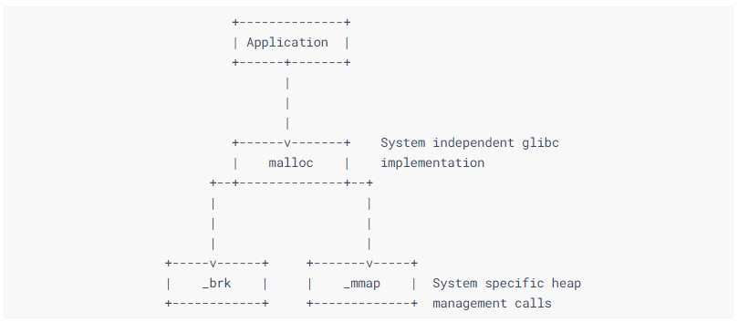
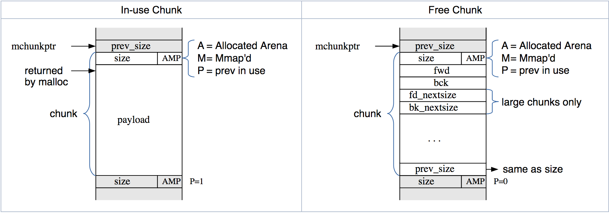

# Understanding the Heap


> One Heap to malloc them all, One Heap to free them, One Heap to coalesce, and in the memory bind them...


阅读本章之前，假设你已经了解C中的 `malloc` 和 `free` 。这一章节介绍关于 Heap exploitation 以及 heap 是如何被程序所管理的。这一章节还涉及到了在 `glibc` 中，是如何实现管理 heap 的。


我计划在这章节中介绍如下这些内容：

 1. 堆和动态内存管理函数？

    `malloc` & `free` 函数族

 2. `sbrk` & `mmap`

 3. Arena

 4. Bins

 5. Chunks

 6. 通过一个简单的案例来看是如何糊弄 `fastbins` 的。


### Heap


Heap 是内存中的一部分空间。它被用作存储使用 `*alloc` 函数族动态创建的变量。和Stack上的变量不一样，虽然Stack上的变量空间也是在程序代码运行的时候动态创建的，但Stack上的变量空间都是在程序代码中写死的所以不算动态内存分配。

在这个段中创建的内存属性都是 global ，这意味着程序中的任何 函数/线程 都可以共享这块内存空间。这块内存空间是通过指针处置的。 如果你对指针不熟悉，可以先看看这个 [this guide]() 

The memory created in this segment is global, in terms that any function/thread in the program can share that memory. They are handled with pointers. If you are not too handy with pointers, you can refer [this guide]() before going forward.

下面这张图展示了应用程序和内存管理系统调用及其组件之间的关系。

The following diagram shows how the application performs memory management calls and which of its components are system (in)/dependent.





`brk()` 系统调用函数可以通过增加 程序的 break location (brk) 从 kernel 获取内存空间（非0初始化的）

初始化状态时，heap的起始指针 ( `start_brk` ) 和 heap 的结尾指针 ( `brk` ) 指向同一个位置。

在程序运行时， `start_brk` 指向 BSS 段的结尾位置（假设ASLR关闭的情况下）

可以通过  `sbrk()`  系统调用来获得程序的 `start_brk` 的值。（需要传递一个参数 `0` ）


`brk` obtains memory (non zero initialized) from kernel by increasing program break location (brk). Initially start (`start_brk`) and end of heap segment (`brk`) would point to same location. 

`start_brk` points to the segment in memory that points to the end of the BSS(in case the ASLR is turned off) during the program run.

 The value for programs `start_brk` can be obtained using `sbrk()` system call, by passing the argument `0` in it.


来看看 系统调用 `sbrk` 是如何工作的：

```C
#include <stdio.h>
#include <unistd.h>
#include <sys/types.h>

int main()
{
    printf("Current program pid %d\n", getpid());
    printf("Current break location %p\n", sbrk(0));
    //used to increment and decrement program break location
    brk(sbrk(0) + 1024);
    printf("Current break location %p\n", sbrk(0));
    getchar();
    return 0;
}
```

```bash
Current program pid 10316
Current break location 0x9380000    <----- Current brk
Current break location 0x9380400
```


下面是查看进程的内存空间情况：

And this is how the process looks like in memory.

```bash
$ cat /proc/10316/maps/
08048000-08049000 r-xp 00000000 00:27 45                                 /vagrant/Lecture7/brk_test
08049000-0804a000 r--p 00000000 00:27 45                                 /vagrant/Lecture7/brk_test
0804a000-0804b000 rw-p 00001000 00:27 45                                 /vagrant/Lecture7/brk_test
0935f000-09381000 rw-p 00000000 00:00 0                                  [heap]     <------------------- Heap segment
...
```


来解析一下输出内容：

`0935f000-09381000` 是这个段的虚拟地址范围。

`rw-p` 是 标志 Flags（Read，Write，Non-Xecute，Private）

`00000000`  是文件偏移量 - 因为这个进程不是由任何其它文件所映射出来的，所以这里偏移量是0

`00:00`	是 Majro/Minor 设备号 - 同上，因为这个进程不是由任何其它文件所映射出来的，所以这里是0

`0` 这个是 inode 号 - 同上，因为这个进程不是由任何其它文件所映射出来的，所以这里是0


​	我们已经知道了 `sbrk` 和 `brk` 被用作 get/set 程序的 break 的偏移量。另一方面 `mmap` 是用来从kernel获取内存以将其添加到 heap 并更新程序的 `brk`。到目前为止，我们都是在讨论 heap 的内存管理，现在我们将要更深入地了解 `heap`。


### Heap 的组织结构：


`glibc` 中针对 heap 实现了多种不同的内存分配的单元的概念。它可以帮助我们更方便地操纵 heap。这些内存分配相关的单元为：Arenas，Bins，Chunks.


#### Arenas:


为了更好地处理多线程应用，`glibc 的 malloc` 允许在同一时间内存中可以有多个区域在活动。

因此，不同的线程可以访问内存中不同的区域，而不会相互影响。这些被分配的内存区域统称作 `arenas` 。

其中，有一个 `主 arena` 它对应应用程序的初始 heap 。在 `malloc` 的代码中有一个静态变量指向这个 arena，其余的每一个 。每一个 `arena` 都有一个 next 指针，来连接下一个 `arena`。

需要理解，物理的 heap（分布在虚拟内存空间）被划分为 arenas 。当程序 `start_brk` 处中断后，主 arena就开始启动。 Arena 是包含多个 bins 的集合。


In order to efficiently handle multi-threaded applications, `glibc's malloc` allows for more than one region of memory to be active at a time. Thus, different threads can access different regions of memory without interfering with each other. These regions of memory are collectively called `arenas`.
There is one arena, the `main arena`, that corresponds to the application's initial heap. There's a static variable in the `malloc` code that points to this arena, and each arena has a next pointer to link additional arenas.
To understand, the physical heap (allocated to VA) is division-ed into arenas. The main arena starts just after the program break `start_brk`. Arena contains collections of bins in it.


#### Bins:


​	bins 是 空闲内存单元 （chunks）的集合。存在四种不同类型的 bins 用作不同目的，每一种都包含用于跟踪空闲 chunks的分配的数据结构。**没有 arena （基本上是所有在arena中的bins）**不是在跟踪 chunks 的分配的。每个 arena 中，都有特定数量的特定 bin.

They are the collection of free memory allocation units called `chunks`. There are 4 different types of bins present in one arena specific to requirement. And each bin contains, allocation data structure that keeps track of free chunks. **No arena (basically the bins in the arena) keeps track of allocated chunks**. Each arena have specific count of specific bin in it.


这四种类型的bins分别是：

 1. **Fast.**

	有 10 个 fast bins。每一个都维护一个单向链表。增加和删除节点的操作都要从链表头开始（LIFO manner）。每一个 bin 都有相同大小的 chunks 。每10个 bins 就对应 16, 24, 32, 40, 48, 56, 64 个 bytes

	没有两个连续的空闲 chunks 是连在一起的。

2. **Unsorted**.
	当 small 和 large chunks 还空闲的时候，它们被初始存储在这种bin中。只有一个unsorted bins。
	 When small and large chunks are free'd they're initially stored in a this bin. There is only 1 unsorted bins.

3. **Small**.

	普通的 bins 分为 small bins （其中的每一个chunk的大小都是相同的）和 large bins （其中的chunks的大小在一定范围内）。当一个chunk添加到这个bins的时候，它们首先与相邻的 chunk 组合成 更大的 chunk。因此，执行 chunk 永远不会与其它此类型的 chunk 相邻。（尽管它们可能与 fast 或 unsort chunk或者正在使用中的chunk 相邻 ）small chunk 和 large chunk 被双向链接，以便可以从中间将 chunk 删除。（例如当它们与新的 free chunk 组合时）

4. **Large**.
	
	   如果一个 bin 里面有不止一种 size 的 chunk ，则这个 bin 为 large bin。对于 small bin 你可以选择第一个 chunk 并使用它。但对于 large bin 你必须找到最合适的 chunk ,并可能将其拆分成两块（一块是刚好需要的大小，另一块是剩余的大小）
	


#### Chunks:

​	Chunks 是 bins 中的基本分配单元。heap 中的内存根据不同类型的 bins 分成不同大小的 chunks （这个大小取决于它们是由哪个 bin 分配的）。每一个 chunk 都包含有关其大小的元数据（通过chunk头部的size字段）以及相邻块的位置。当 chunk 被释放后，曾经是应用程序数据的内存将重新用于其他与 arena 相关的信息。就如 链表中的指针 ，以便可以在需要时快速找到并重新使用合适的 chunks 。chunks 的大小始终为8的倍数，这允许将最后三位用作标志位。 


三种标志分别是：

- **A**
	分配 的Arena - 主 arena 使用应用程序的 heap。其它的 arenas 使用 mmap 分配得到的 heaps 。想要映射一个 chunk 到 heap，你需要了解具体是哪种情况。如果这个 标志值 设置为 0 ，chunk 将来自 main arena 和 main heap。 如果这个 标志值 设置为 1 ，chunk 将是来自 mmap 分配的内存，而 heap 的地址将可以通过 chunk 的地址计算得到。
- **M**
	MMap得到的 chunk - 该 chunk 是通过对mmap的一次调用分配的，它并不属于 heap 的一部分。
- **P**
	如果这个标志位被设置，则代表前一个 chunk 被应用程序所使用中，因此 prev_size 字段是无效的。注意，尽管应用程序释放了一些 chunk ，例如在 fastbins 中的 chunk（请参见下文），但该标志位仍将被设置为1。 这一点真的意味着前面的 chunk 不应该被作为要使用的选择。 - 它被 应用程序或 malloc中的其它一些优化机制所 “使用中”。


​	chunk 看起来像这样：

​	The chunk may look like the following:



### 中小型 bins 的分配：


`glibc` 中的 malloc 使用了 first fit 算法来实现在中小型 bins 中 chunks 的分配。顾名思义，在此实现中，内存中第一个空闲的且大小对于分配请求而言足够的位置，会被按请求进行分割，然后分配给请求。


来看看 `use after free exploit` 会发生什么：

```C
#include <stdio.h>
#include <stdlib.h>
#include <string.h>

int main()
{
    printf("如果一个 chunk 是空闲的并且对于申请的空间而言足够大了，malloc 就会选择这个 chunk\n");
    printf("If a chunk is free and large enough, malloc will select this chunk.\n");
    printf("This can be exploited in a use-after-free situation.\n");

    char* a = malloc(512);
    char* b = malloc(256);
    char* c;

    printf("1st malloc(512): %p\n", a);
    printf("2nd malloc(256): %p\n", b);
    strcpy(a, "this is A!");
    printf("first allocation %p points to %s\n", a, a);

    printf("Freeing the first one...\n");
    free(a);

    printf("We don't need to free anything again. As long as we allocate less than 512, it will end up at %p\n", a);

    printf("So, let's allocate 500 bytes\n");
    c = malloc(500);
    printf("3rd malloc(500): %p\n", c);
    printf("And put a different string here, \"this is C!\"\n");
    strcpy(c, "this is C!");
    printf("3rd allocation %p points to %s\n", c, c);
    printf("first allocation %p points to %s\n", a, a);
    printf("If we reuse the first allocation, it now holds the data from the third allocation.");
}
```
​	执行程序并注意到，指针 `c` 和指针 `a` 指向了同一个位置。无论是 small 还是 large chunks/bins 都存在在释放后被利用的可能。 其中释放的指针即使在释放后依然可以被利用。 


### Fast bin 的分配：


​	如前面所介绍过的，fastbins 维护一个 单向链表。这里我指的是 free 的 chunks 。**始终记住，bins的指针只会指向 free chunks** 而不会指向已经被分配的 chunks 。程序员有责任管理好自己申请分配的 chunk ，并在不需要后将其手动释放掉。当一个chunk被释放时，它被添加到 fastbin 链表的头部，并且一个chunk被分配时，头节点 chunk 将被从链表中删除并准备分配。 chunk  如果维护不当，fastbins 可以被利用 执行 双重释放漏洞利用。通常是在程序员错误地释放了两次内存的情况下发生的。攻击者可以用它来执行恶意操作。请看下面代码：


```C
#include <stdio.h>
#include <stdlib.h>
int main()
{
    void *a, *b, *c, *d, *e, *f;
    a = malloc(32);
    b = malloc(32);
    c = malloc(32);

    printf("%p %p %p\n", a, b, c);
    free(a);                                //fastbin head -> a > tail
    //To avoid double free correction or fasttop check, free something other than a
    free(b);                                //fastbin head b -> a > tail
    free(a);                                //fastbin head a -> b -> a > tail

    d = malloc(32);                         //fastbin head -> b -> a -> tail first a popped
    e = malloc(32);                         //fastbin head -> a -> tail first b popped
    f = malloc(32);                         //fastbin head -> tail second a popped
    printf("%p %p %p", d, e, f);
    return 0;
}
```
这会导致指针 `d` 和 `f` 指向内存中的同一个位置。这叫 双重释放漏洞利用。


